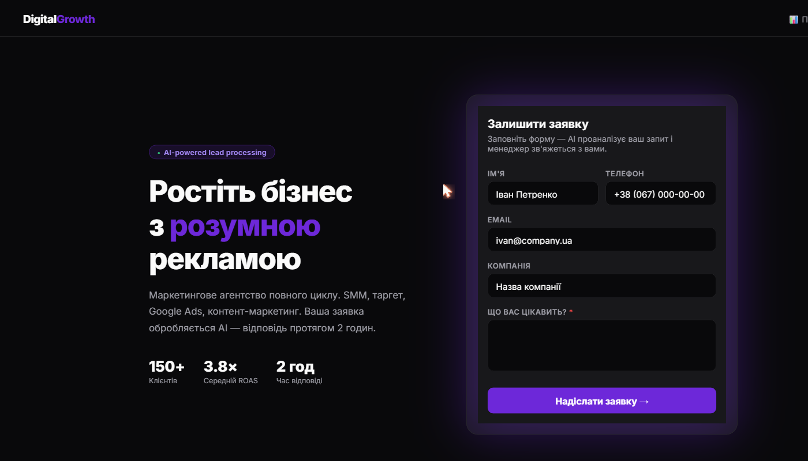
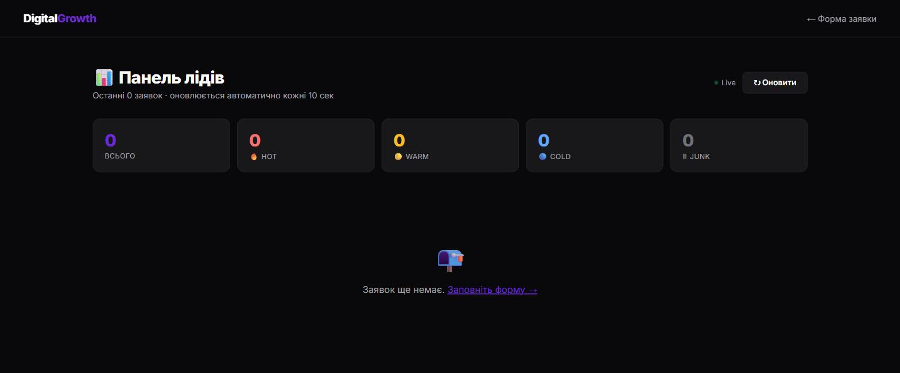
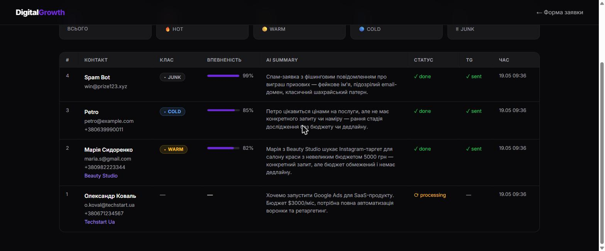
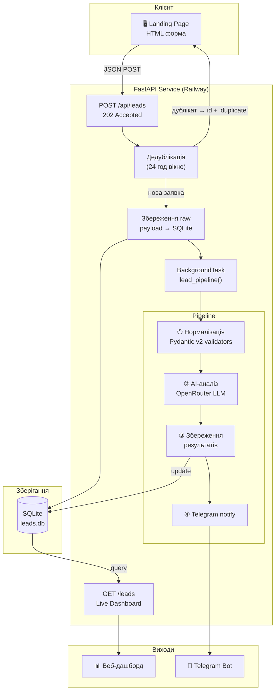
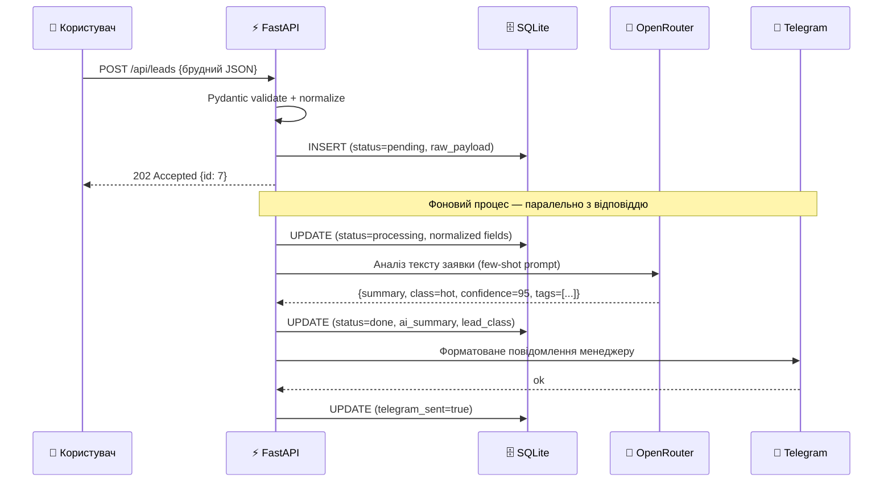
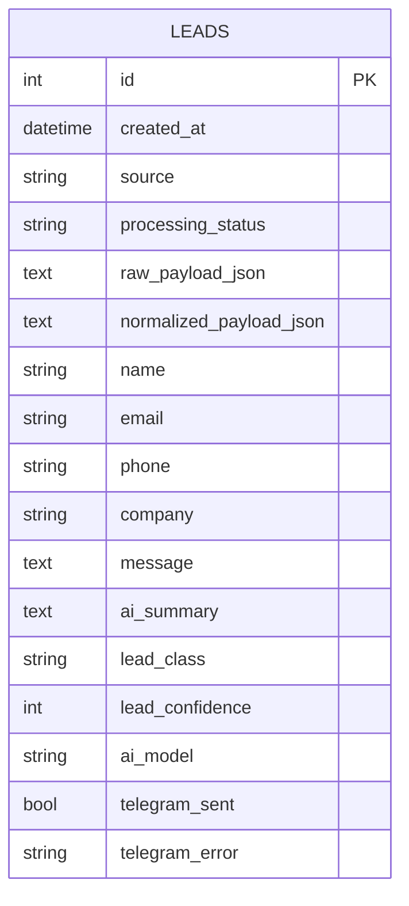

# Lead Processing MVP

> Автоматизований AI-pipeline для обробки заявок з лендінгу:
> форма → нормалізація → AI-класифікація → дашборд → Telegram

[](https://python.org)
[](https://fastapi.tiangolo.com)
[](https://docs.pydantic.dev)
[](https://web-production-82e68.up.railway.app)

**🌐 Live demo:** https://web-production-82e68.up.railway.app

---

## Скріншоти

### Лендінг — форма прийому заявок


### Панель лідів — результати AI в реальному часі



> Дашборд оновлюється кожні 10 секунд. Видно як messy-інпут `  мАРІЯ сИДОРЕНКО  ` автоматично нормалізувався до `Марія Сидоренко`, а спам-бот отримав `junk` з впевненістю 99%.

---

## Що робить система

Форма на лендінгу приймає заявку. Далі — повністю автоматично:

```
Форма  →  POST /api/leads  →  202 Accepted (миттєво)
                                    ↓
                             BackgroundTask
                                    ↓
                          [1] Нормалізація (Pydantic)
                                    ↓
                          [2] AI-аналіз (OpenRouter LLM)
                                    ↓
                          [3] Збереження в БД
                                    ↓
                          [4] Telegram-сповіщення
```

Клієнт отримує `202` **миттєво** — незалежно від часу відповіді LLM (1–3 сек).

---

## Архітектура системи



---

## Потік обробки (Sequence Diagram)



---

## Нормалізація даних

`LeadIn` (Pydantic v2) автоматично очищує сирий ввід через `@field_validator`:

| Поле | Сирий ввід | Після нормалізації |
|------|-----------|-------------------|
| `name` | `  мАРІЯ сИДОРЕНКО  ` | `Марія Сидоренко` |
| `email` | `  IVAN.Petrov@Gmail.COM  ` | `ivan.petrov@gmail.com` |
| `phone` | `+38 (067) 123-45-67` | `380671234567` |
| `phone` | `0982223344` | `380982223344` |
| `company` | `  acme ua ltd  ` | `Acme Ua Ltd` |
| `message` | `  текст з пробілами  ` | `текст з пробілами` |

**Приклад — брудний payload → нормалізований:**

```json
// Вхід: sample_payloads/lead_dirty.json
{
  "name":    "  іВАН пЕТРОВ  ",
  "email":   "  IVAN.Petrov@Gmail.COM  ",
  "phone":   "+38 (067) 123-45-67",
  "company": "  acme ua ltd  ",
  "message": "Хочемо замовити Google Ads..."
}

// Після Pydantic validators:
{
  "name":    "Іван Петров",
  "email":   "ivan.petrov@gmail.com",
  "phone":   "380671234567",
  "company": "Acme Ua Ltd",
  "message": "Хочемо замовити Google Ads..."
}
```

---

## AI-класифікація

LLM отримує нормалізовані дані і повертає структурований JSON.
System prompt включає **6 few-shot прикладів** — з урахуванням edge-кейсів:

| Клас | Значення | Приклад тригера |
|------|---------|----------------|
| 🔥 `hot` | Готовий купити, є бюджет/дедлайн | "бюджет $3000/міс, запуск наступного місяця" |
| 🟡 `warm` | Зацікавлений, але деталей мало | "хочу SMM, бюджет обговоримо" |
| 🔵 `cold` | Рання стадія, немає конкретного запиту | "просто цікавлюся цінами" |
| 🗑 `junk` | Спам / нерелевантне | `win@prize123.xyz`, "click here now!!!" |
| 🔶 `manual_review` | Неоднозначно, потрібна людина | суперечливі або надто мізерні дані |

**Схема відповіді** (валідується через `LeadAIResult`):

```json
{
  "summary":        "Олександр з TechStart UA шукає Google Ads для SaaS-продукту з бюджетом $3000/міс...",
  "lead_class":     "hot",
  "confidence":     95,
  "missing_fields": [],
  "reasoning_tags": ["budget_mentioned", "saas", "google_ads", "deadline_implicit"]
}
```

---

## Дедублікація

Якщо протягом **24 годин** надійде заявка з тим самим `email + phone + message[:100]` — система повертає `id` оригінальної заявки зі статусом `"duplicate"` без повторної обробки й сповіщення.

---

## Схема бази даних



| Колонка | Опис |
|---------|------|
| `processing_status` | `pending → processing → done / error` |
| `raw_payload_json` | Оригінальний JSON без змін (для аудиту) |
| `normalized_payload_json` | Дані після Pydantic validators |
| `lead_class` | `hot / warm / cold / junk / manual_review` |
| `lead_confidence` | Впевненість AI (0–100%) |
| `telegram_sent` | Підтвердження відправки |

---

## Стек технологій

| Шар | Технологія | Роль |
|-----|-----------|------|
| Web framework | FastAPI 0.136 | HTTP routes, BackgroundTasks, lifespan |
| Валідація | Pydantic v2 | Normalize on ingestion, schema validation |
| База даних | SQLAlchemy 2 + SQLite | ORM, зберігання всіх даних |
| AI | OpenRouter (owl-alpha) | Аналіз та класифікація лідів |
| Сповіщення | Telegram Bot API + httpx | Push до менеджера |
| Шаблони | Jinja2 | SSR-дашборд і лендінг |
| Deploy | Railway | Auto-deploy з GitHub, env vars |
| Тести | pytest + FastAPI TestClient | Unit + smoke tests |

---

## Структура проєкту

```
lead-processing-api/
│
├── app/
│   ├── main.py                 # Роути, дедублікація, lifespan (create tables)
│   ├── models.py               # SQLAlchemy Lead model
│   ├── schemas.py              # LeadIn (validators), LeadAIResult, LeadOut
│   ├── db.py                   # Engine + SessionLocal + get_db
│   ├── llm.py                  # OpenRouter client, few-shot prompt, analyze_lead()
│   ├── telegram.py             # send_telegram_notification()
│   ├── services/
│   │   └── lead_pipeline.py    # Повний pipeline: normalize → AI → DB → TG
│   └── templates/
│       ├── index.html          # Лендінг (темний UI, AJAX-форма)
│       └── leads.html          # Дашборд (статистика, таблиця, auto-refresh)
│
├── tests/
│   ├── test_pipeline_smoke.py  # Smoke-тест HTTP endpoints + БД
│   └── test_normalizers.py     # Unit-тести нормалізації
│
├── sample_payloads/            # 6 JSON для тестування
│   ├── lead_valid.json
│   ├── lead_dirty.json         # Бруд: змішаний регістр, зайві пробіли
│   ├── lead_minimal.json       # Тільки message
│   ├── lead_warm.json
│   ├── lead_cold.json
│   └── lead_junk.json
│
├── docs/screenshots/
├── Procfile                    # web: uvicorn app.main:app --host 0.0.0.0 --port $PORT
├── requirements.txt
└── .env.example
```

---

## API Endpoints

| Метод | Шлях | Опис |
|-------|------|------|
| `GET` | `/` | Лендінг з формою |
| `POST` | `/api/leads` | Прийняти заявку → `202 Accepted` |
| `GET` | `/leads` | Live-дашборд (HTML) |
| `GET` | `/debug/leads` | Останні ліди як JSON |
| `GET` | `/health` | Health check |
| `GET` | `/docs` | Swagger UI |

### Приклад POST /api/leads

```bash
curl -X POST https://web-production-82e68.up.railway.app/api/leads \
  -H "Content-Type: application/json" \
  -d '{
    "name": "Іван Петров",
    "email": "ivan@company.ua",
    "phone": "+38 067 123 45 67",
    "company": "ACME LTD",
    "message": "Потрібен таргет Facebook. Бюджет 15 000 грн/міс, запуск наступного місяця.",
    "source": "google"
  }'
```

```json
{"id": 7, "status": "accepted", "message": "Заявку прийнято"}
```

---

## Локальний запуск

```bash
git clone https://github.com/yoydich/lead-processing-api.git
cd lead-processing-api

python -m venv venv
venv\Scripts\activate        # Windows
# source venv/bin/activate   # Mac/Linux

pip install -r requirements.txt

cp .env.example .env         # заповни ключі
uvicorn app.main:app --reload
```

- Лендінг: http://localhost:8000
- Дашборд: http://localhost:8000/leads
- Swagger: http://localhost:8000/docs

### Тести

```bash
pytest tests/ -v
```

---

## Змінні середовища

| Змінна | Обов'язково | Опис |
|--------|-------------|------|
| `OPENROUTER_API_KEY` | ✅ | API-ключ OpenRouter |
| `OPENROUTER_MODEL` | — | Модель (за замовч. `openrouter/owl-alpha`) |
| `TELEGRAM_BOT_TOKEN` | ✅ | Токен Telegram-бота |
| `TELEGRAM_CHAT_ID` | ✅ | ID чату/каналу для сповіщень |
| `DATABASE_URL` | — | SQLite за замовч., для prod — PostgreSQL |

### .env.example

```env
OPENROUTER_API_KEY=sk-or-...
OPENROUTER_MODEL=openrouter/owl-alpha
TELEGRAM_BOT_TOKEN=123456789:AAF...
TELEGRAM_CHAT_ID=123456789
DATABASE_URL=sqlite:///./leads.db
```

---

## Деплой на Railway

1. Push проєкт на GitHub
2. [railway.app](https://railway.app) → **New Project → Deploy from GitHub**
3. Обери репозиторій — Railway автоматично знаходить `Procfile`
4. **Variables** → додай 4 env vars з таблиці вище
5. Deploy → отримай публічний URL

Кожен push до `master` → автоматичний редеплой.

---

## Тестові payload'и

```bash
# Чистий hot-лід
curl -X POST https://web-production-82e68.up.railway.app/api/leads \
  -H "Content-Type: application/json" -d @sample_payloads/lead_valid.json

# Брудний ввід (нормалізація в дії)
curl ... -d @sample_payloads/lead_dirty.json

# Спам
curl ... -d @sample_payloads/lead_junk.json
```
